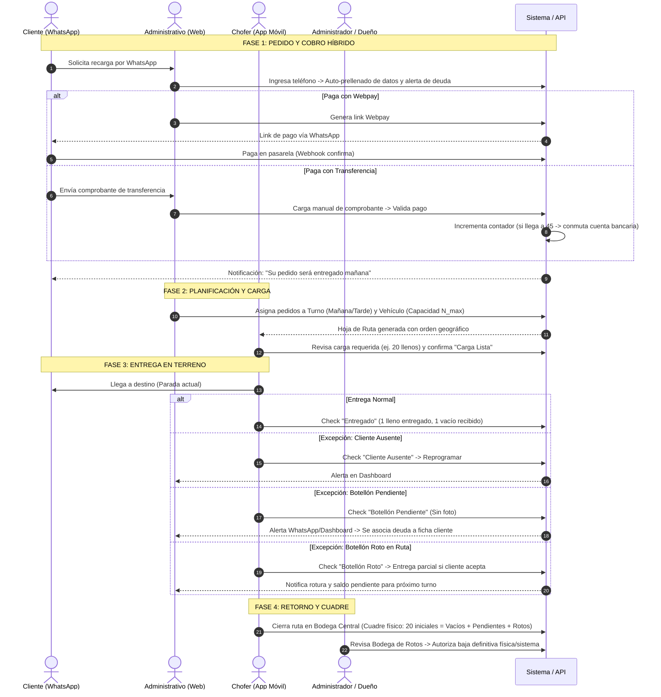
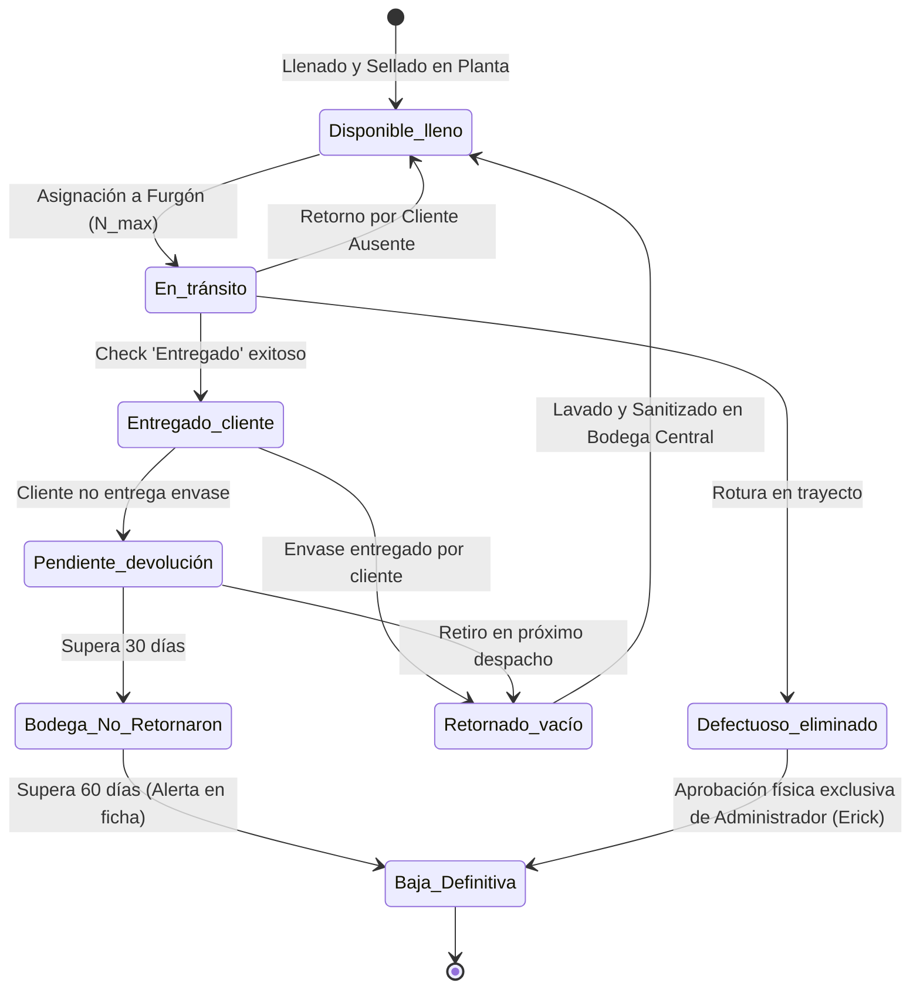

# Mapeo de Experiencia de Administrativo y Chofer
**Documento de Diseño UX, Flujos Operativos y Estados de Pantalla**
*Proyecto Integrado: Distribución de Bidones de Agua Purificada (MVP)*  
**Work Item Azure Boards:** [#47](https://dev.azure.com/ignaciosalinas/Proyecto%20Integrado/_workitems/edit/47) | **Sprint:** 1 | **Responsable:** Fabián Jeldes

---

## 1. Ficha Técnica y Objetivo del Requerimiento

* **Criterio de Aceptación Oficial:**  
  > *«Flujos y estados de pantalla cubren pedido, carga, entrega e incidencia.»*
* **Alcance:** Modelar de extremo a extremo la experiencia de trabajo del **Personal Administrativo** (gestión de ventas, pagos, coordinación y excepciones) y del **Chofer / Repartidor** (carga, hoja de ruta, entrega ágil y registro de envases), integrando la supervisión del **Administrador / Dueño (Erick)**.
* **Fuentes de Entrada:**  
  * Informe Técnico INACAP (Arquitectura, FSM de 6 estados, balances de stock).
  * Minuta y Transcripción de Levantamiento Operacional con Erick (Operaciones).
  * Actualización de Reglas de Negocio del 06 de Octubre (`update_06Octubre.md`).

---

## 2. Perfiles de Usuario y Matriz de Roles

| Dimensión | 👩‍💼 Administrativo (Secretaría / Ventas) | 🚚 Chofer (Repartidor en Ruta) | 👔 Administrador / Dueño (Erick) |
| :--- | :--- | :--- | :--- |
| **Contexto de uso** | Oficina / Escritorio, PC con teclado y pantalla amplia, conectado a WhatsApp Web. | Móvil en terreno, una sola mano, vehículo en marcha/parado, luz solar, posibles zonas sin cobertura. | Supervisión ejecutiva, tablet/PC o smartphone. |
| **Responsabilidades clave** | • Atender solicitudes de WhatsApp. • Crear pedidos prellenados. • Enviar links Webpay o validar transferencias bancarias. • Resolver alertas de botellones pendientes. • Coordinar retiros con clientes deudores. | • Revisar botellones asignados. • Cargar físicamente el furgón. • Seguir orden geográfico de entrega. • Marcar "Entregado" con 1 toque. • Reportar botellones pendientes o rotos sin fricción. | • Configurar parámetros ($N_{\max}$ capacidad furgones, precios, cuentas bancarias). • Autorizar baja física de botellones rotos. • Monitorear KPIs globales (ventas, stock, balances). |
| **Puntos de dolor resueltos** | • Búsqueda manual lenta en chat de WhatsApp. • Olvido de cobrar o recuperar botellones pendientes. • Límites de transferencias en cuenta bancaria. | • Falta de orden de paradas. • Formularios engorrosos o exigencia de fotos en terreno. • Pérdida de conectividad móvil en ruta. | • Descuadre entre botellones llenos, vacíos y mermas. • Sobrecarga de mensajes operativos en su teléfono personal. |

---

## 3. Service Blueprint y Flujo de Servicio End-to-End

A continuación se detalla la interacción en 5 fases operativas:

---

## 4. Matriz de Flujos y Estados de Pantalla

Cumpliendo el Criterio de Aceptación del ítem #47 (*«Flujos y estados de pantalla cubren pedido, carga, entrega e incidencia»*), se formaliza la siguiente matriz:

### 4.1. Flujo 1: Pedido (Administración Web)

* **Objetivo:** Registrar clientes, prellenar pedidos rápidamente, gestionar cobro (Webpay / Transferencia) y rotación de cuenta.
* **Estados de Pantalla:**

| Estado de Pantalla | Elementos Visuales / Interacción | Comportamiento del Sistema |
| :--- | :--- | :--- |
| **`PEDIDO_BUSQUEDA`** | Barra de búsqueda reactiva por teléfono o nombre; listado de coincidencias recientes. | Consulta indexada de clientes. Si no existe, botón inmediato `+ Nuevo Cliente`. |
| **`PEDIDO_FORMULARIO_PRELLENADO`** | Formulario con datos cargados del último pedido: dirección frecuente, cantidad de bidones y tipo. | Valida si el cliente tiene saldo deudor de envases. Si tiene botellones no retornados, muestra **Banner Amarillo**: *"Cliente adeuda X envases. Coordinar retorno antes de autorizar"*. |
| **`PEDIDO_PAGO_WEBPAY`** | Botón `Generar Link Webpay`. Muestra URL acortada y botón `Copiar para WhatsApp`. Estado: `Pendiente de Pago`. | Webhook escucha la confirmación de Transbank. Al confirmarse, la pantalla pasa automáticamente a `Pagado / Listo para Despacho`. |
| **`PEDIDO_PAGO_TRANSFERENCIA`** | Modal para subir comprobante (PDF/JPG), monto y cuenta bancaria de destino. | Al validar: incrementa el contador de la cuenta activa. Si el contador llega a **45**, muestra alerta: *"Cuenta rotada automáticamente por umbral de seguridad"*. |
| **`PEDIDO_CONFIRMADO`** | Badge verde `Pagado`. Botón `Enviar Confirmación WhatsApp` con texto preformateado: *"Su pedido será entregado mañana"*. | Pedido entra en la cola de asignación de turnos. |

---

### 4.2. Flujo 2: Carga y Planificación de Furgón (Administración Web & Chofer Móvil)

* **Objetivo:** Asignar pedidos a vehículos sin exceder la capacidad máxima parametrizable ($N_{\max} \ge 12$), programar turnos y validar carga física.
* **Estados de Pantalla:**

| Estado de Pantalla | Perfil | Elementos Visuales / Interacción | Regla de Negocio / Disparador |
| :--- | :--- | :--- | :--- |
| **`DESPACHO_PLANIFICADOR`** | Admin | Vista de dos columnas: Pedidos pendientes del día vs. Vehículos disponibles con barra de progreso de capacidad (ej: `14/20 botellones`). | Bloqueo preventivo: Si la suma de botellones supera $N_{\max}$, el sistema impide asignar más pedidos a ese vehículo. |
| **`DESPACHO_TURNO_ASIGNADO`** | Admin | Selector de turno (`Mañana` / `Tarde`). Botón `Publicar Hoja de Ruta`. | Descuenta botellones de `Bodega Central (Llenos)` y los asigna a `En Tránsito (Furgón)`. |
| **`CARGA_RESUMEN_CHOFER`** | Chofer | Tarjeta superior: *"Tu vehículo: Furgón 1 - Carga: 20 botellones llenos"*. Lista de chequeo previa. | El chofer cuenta los bidones cargados en bodega y presiona `Confirmar Carga y Salir`. |
| **`CARGA_BLOQUEADA_OFFLINE`** | Chofer | Notificación superior no intrusiva: *"Modo offline activado. Datos guardados localmente"*. | Sincronización transparente vía LocalStorage / PWA Service Worker cuando vuelva la señal. |

---

### 4.3. Flujo 3: Entrega en Terreno y Hoja de Ruta (Chofer Móvil)

* **Objetivo:** Guiar al chofer parada por parada en orden geográfico óptimo con interacción de un solo toque y sin fotos obligatorias.
* **Estados de Pantalla:**

| Estado de Pantalla | Elementos Visuales / Interacción | Comportamiento del Chofer / Sistema |
| :--- | :--- | :--- |
| **`RUTA_LISTA_PARADAS`** | Lista ordenada de paradas con número de parada, dirección, nombre de cliente, cantidad a entregar y botón directo de GPS (Google Maps / Waze). | Muestra badge si la entrega incluye una instrucción especial (ej: *"Retirar botellón pendiente anterior"*). |
| **`PARADA_DETALLE_ACTIVA`** | Tarjeta expandida de la parada actual. Acciones principales: • Botón grande verde: `Confirmar Entrega` • Botón secundario: `Reportar Incidencia / Excepción` | Al presionar `Confirmar Entrega`, se asume por defecto entrega completa (1 lleno entregado, 1 vacío recibido). Transición inmediata a la siguiente parada. |
| **`PARADA_COMPLETADA`** | Check verde animado, colapso de la tarjeta y auto-enfoque en la siguiente parada. Contador de progreso: `Parada 4 de 12 completadas`. | Envío asíncrono del evento a la API (o almacenamiento en cola local si no hay red). |

---

### 4.4. Flujo 4: Incidencias y Excepciones (Chofer Móvil & Alertas Admin)

* **Objetivo:** Resolver contingencias en terreno (cliente ausente, olvido de botellón vacío, rotura en trayecto) manteniendo la cuadratura de stock.
* **Estados de Pantalla:**

| Estado de Pantalla | Perfil | Interacción y UI | Disparadores y Consecuencias |
| :--- | :--- | :--- | :--- |
| **`INCIDENCIA_MODAL_CHOFER`** | Chofer | Modal con 3 botones de gran tamaño táctil: 1. `Botellón Pendiente` 2. `Cliente Ausente` 3. `Botellón Roto / Fisurado` | No se exige fotografía obligatoria (evita demoras y fricción en terreno). |
| **`INCIDENCIA_BOTELLON_PENDIENTE`** | Chofer | Check de confirmación rápida: *"Cliente no tiene envase vacío"*. Campo de nota opcional (ej: *"Conserjería sin llaves"*). | • El botellón lleno se entrega. • El estado del envase pasa a `Pendiente_devolución`. • Se genera alerta inmediata en Dashboard de la secretaria. • Se programa retiro automático para el próximo despacho de ese cliente. |
| **`INCIDENCIA_CLIENTE_AUSENTE`** | Chofer | Botón `Marcar Ausente`. Notificación al chofer: *"Continuar con siguiente parada"*. | El pedido no se entrega; el botellón sigue `En Tránsito` y regresa a `Bodega Central` al final del turno. Admin coordina por WhatsApp para reintentar. |
| **`INCIDENCIA_ROTURA_PARCIAL`** | Chofer | Selector de cantidad rota (ej: 1 de 2 bidones rotos). Botón `Entrega Parcial Aceptada`. | Se entrega el bidón bueno; el roto se marca `Defectuoso_eliminado`. Se genera orden de saldo pendiente para el turno siguiente sin cobrar extra. |
| **`DASHBOARD_ALERTAS_ADMIN`** | Admin | Centro de Notificaciones en tiempo real: • Alertas de Botellones Pendientes (por antigüedad). • Alertas de Rotación Bancaria (45 comprobantes). • Alertas de Roturas pendientes de inspección. | Permite al administrativo disparar mensaje de WhatsApp preformateado al cliente con 1 clic. |

---

## 5. Ciclo de Vida del Botellón: Máquina de Estados Finitos (FSM)

El inventario se modela bajo 6 estados discretos según las especificaciones del informe INACAP y las definiciones del 06 de Octubre:

### Regla Matemática de Balance Continuo de Stock:
En cualquier instante de tiempo $t$, el sistema debe auditar la siguiente ecuación de conservación de inventario:

$$\text{Stock Total Empresa} = \text{Llenos}_{\text{Central}} + \text{Vacíos Disponibles}_{\text{Central}} + \text{En Tránsito}_{\text{Furgón}} + \text{Pendientes Devolución} + \text{Rotos/Eliminados}$$

* **Verificación al cierre de turno:**
  $$\text{Llenos Cargados Iniciales} = \text{Llenos No Entregados (Retornados)} + \text{Vacíos Recolectados} + \text{Pendientes Justificados} + \text{Rotos Justificados}$$

---

## 6. Reglas de Negocio Operacionales Clave

1. **Gestión de Cuentas Bancarias (Regla de los 45 Comprobantes):**
   * El sistema mantiene un contador entero persistente de transferencias validadas por cuenta bancaria.
   * Al alcanzar exactamente **45 comprobantes validados**, el sistema conmuta automáticamente los datos bancarios mostrados al administrativo para entregar al cliente.
   * Se emite una alerta no bloqueante al WhatsApp del administrativo notificando la rotación.
2. **Escalamiento de Envases Pendientes (30 y 60 días):**
   * **Día 0:** Chofer marca excepción -> Alerta visible en Dashboard.
   * **Día 1 a 29:** Si el cliente vuelve a pedir, el pedido agrega obligatoriamente la tarea de "Retiro de envase pendiente".
   * **Día 30:** Pasa automáticamente a "Bodega de No Retornaron" (descontado de circulación preventiva).
   * **Día 60:** Baja definitiva contable del activo; queda bandera roja permanente en la ficha del cliente. Si vuelve a pedir, el administrativo debe exigir el retorno o cobro de reposición antes de liberar el pedido.
3. **Gobierno de Mermas y Bajas:**
   * El chofer **únicamente reporta** el botellón roto.
   * El botellón ingresa físicamente a la *Bodega de Rotos*.
   * **Solo el perfil Administrador / Dueño (Erick)** tiene el privilegio en el sistema para dar de baja definitiva un botellón tras inspección física.

---

## 7. Próximos Pasos (Derivación a Tareas #48 y #49)

Este mapeo establece las bases directas para la construcción de los prototipos:
* **Para la Tarea #48 (Diseñar interfaz de administración de pedidos):** Construcción del panel web con módulo de pedidos prellenados, switch de cuentas bancarias y dashboard de alertas operativas.
* **Para la Tarea #49 (Diseñar interfaz móvil de reparto):** Construcción de la interfaz mobile-first para el chofer con paradas ordenadas geográficamente, check de entrega rápida y modal de excepciones sin fotos.
